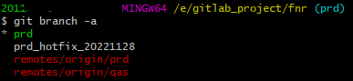
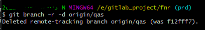
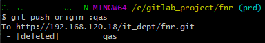

# git常用命令

## 日常命令

```
git pull/fetch
git add .
git commit -m "xxx"
git push
```

## 分支管理

```
//新建分支
git checkout -b dev
//删除分支
git branch -d dev
//合并分支
git merge dev
```

## 删除远程分支


> //删除分支
> git branch -d qas

> 查看共有分支
> git branch -a


> 删除远程qas分支
> git branch -r -d origin/qas


> 推送使远程分支生效
> git push origin :qas


## 代理网络设置

> 代理IP请自行替换

```
// cmd 设置代理
 set http_proxy=http://192.168.1.1:8000
 set https_proxy=http://192.168.1.1:8000

 //git 命令行代理
 git config --global http.proxy http://127.0.0.1:1080
 git config --global https.proxy https://127.0.0.1:1080

 //git 删除代理
 git config --global --unset http.proxy
 git config --global --unset https.proxy
```
