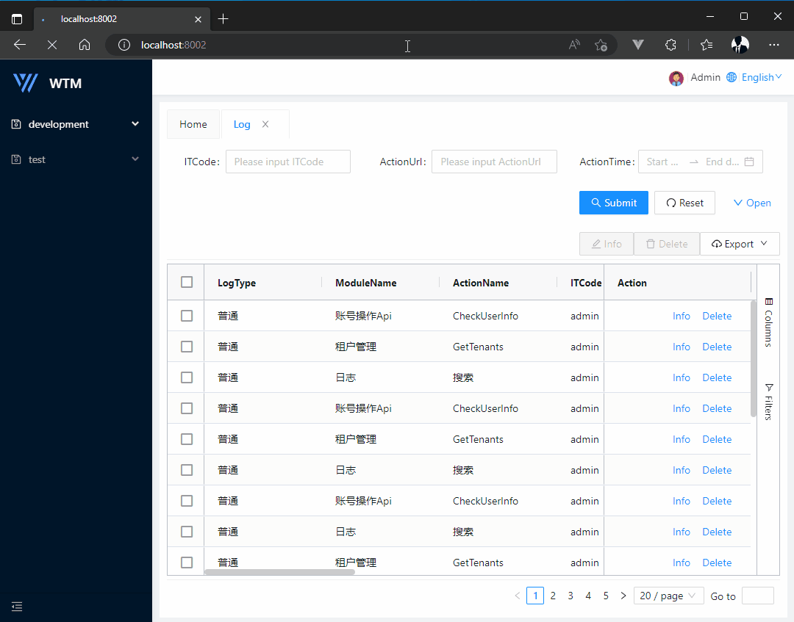
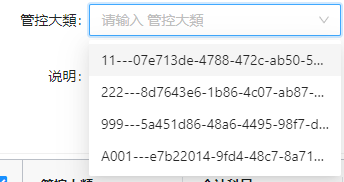

# wtm学习笔记

## wtm swagger集成开启

> 方法一：StartUp.cs 找到Configure，在app.UseWtmSwagger()中传入一个参数false，即app.UseWtmSwagger(false)
> 方法二：appsettings.json中将IsQuickDebug设置为true

## 多语系问题

> wtmplus vue3 进到主页的时候切换多语言是正常，点进菜单后再切换多语言就不会在右上角切换语系显示。



## 自己只能看到自己的创建或修改的资料

> 这种情况不属于wtm的"数据权限"的概念, 因为完全可以这么写:
```
.Where(x => x.UpdateBy == LoginUserInfo.Id)
```

## 下拉选择框显示key-value

> 修改代码ClientApp/src/components/page/field/script.ts:
```
// 加载数据源
    async onRequest() {
        this.spinning = true;
        const startTime = Date.now()
        try {
            const res = await this.lodash.invoke(
                this,
                "_request",
                this.lodash.cloneDeep(this.formState)
            );
            res.forEach(x=>x.label = x.label+'---'+x.value)
            //console.error('test for me:',res)
            this.dataSource = res;
        } catch (error) {
            console.error("LENG ~ onRequest", error)
        }
        if (this.dataSource.length > 0) {
            const endTime = Date.now()
            const diffTime = 400 - (endTime - startTime);
            // 保证动画最少500考秒
            await of(1).pipe(delay(diffTime > 0 ? diffTime : 0)).toPromise()
        }
        this.spinning = false;
    }
```
